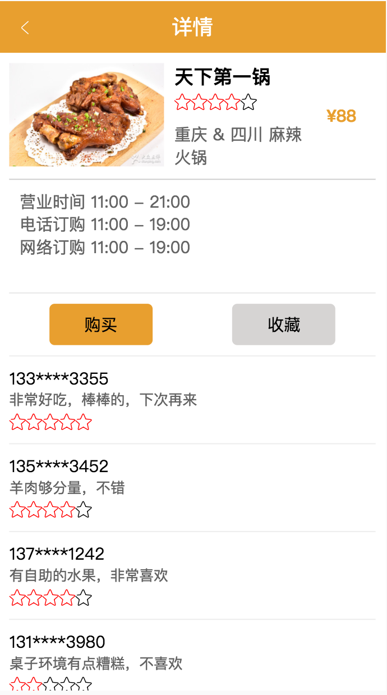
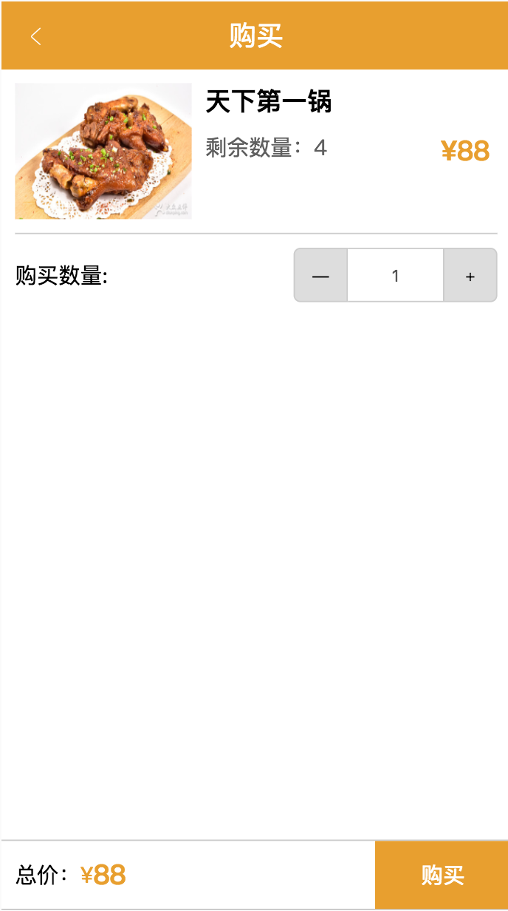
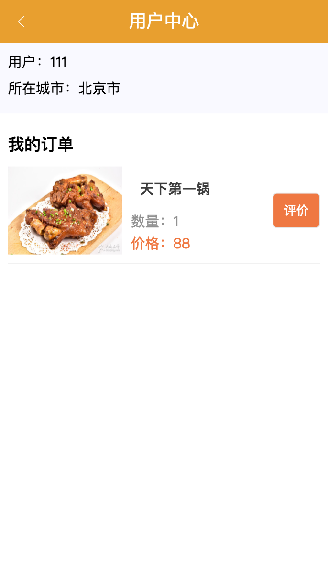
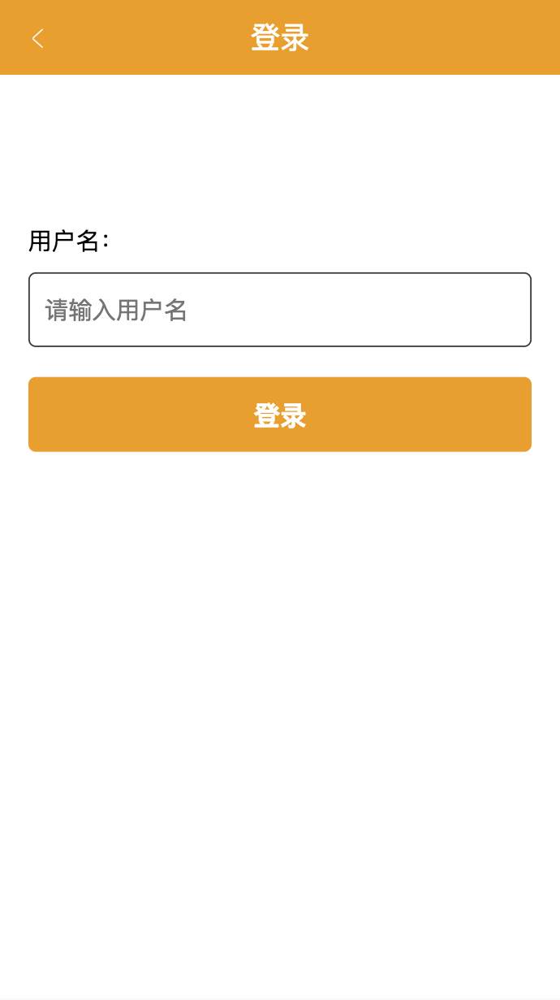
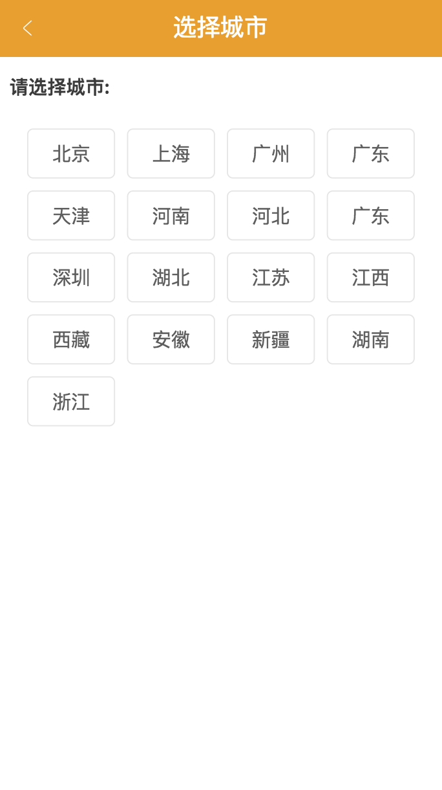
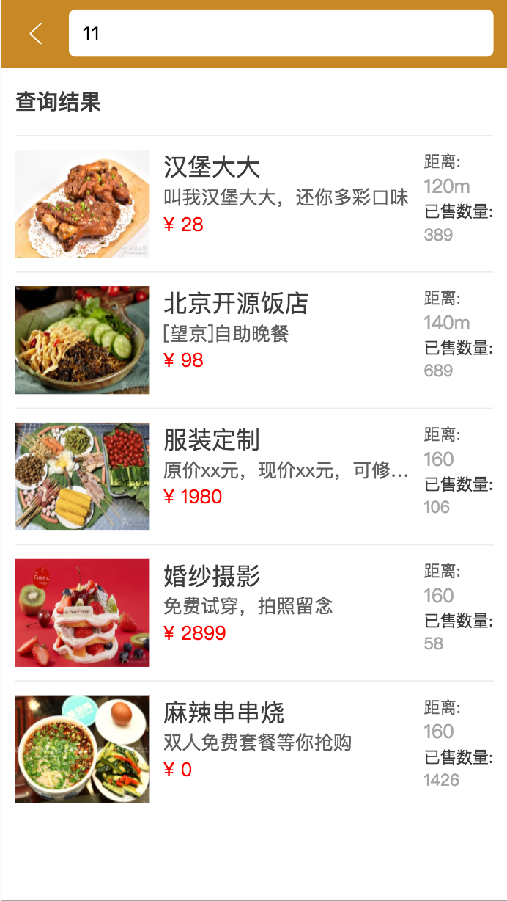

## React商城课件APP

## 概述
项目后端使用express，前端使用react

前端技术栈为

- 基础列库：react
- 路由：react-router4
- 数据管理：react-redux + redux
- 样式：less + postcss

## 运行方式
开发环境运行方式：npm run dev

编译代码：npm run build

Node.js服务器：启动server.js

## 项目展示

